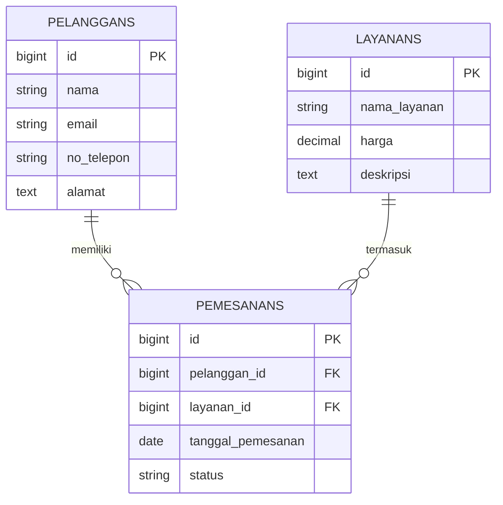

# Aplikasi Pemesanan Layanan - Seleksi TeFa RPL SMKN 1 Katapang

Sistem informasi berbasis Web untuk manajemen pemesanan layanan, pengolahan data pelanggan, serta pemantauan status transaksi secara real-time.

---

## Fitur Utama
- **Sistem CRUD Lengkap:** Pengolahan data Layanan, Pelanggan, dan Pemesanan.
- **Manajemen Status Pemesanan:** Pelacakan status transaksi secara terstruktur.
- **Pencarian & Filter:** Pencarian data interaktif pada tabel utama.
- **Dashboard Ringkasan:** Ringkasan statistik transaksi dan layanan populer.

---

## Tech Stack
- **Framework:** Laravel
- **Database:** MySQL
- **Templating:** Blade Engine
- **Styling:** Tailwind CSS

---

## Entity Relationship Diagram (ERD)

